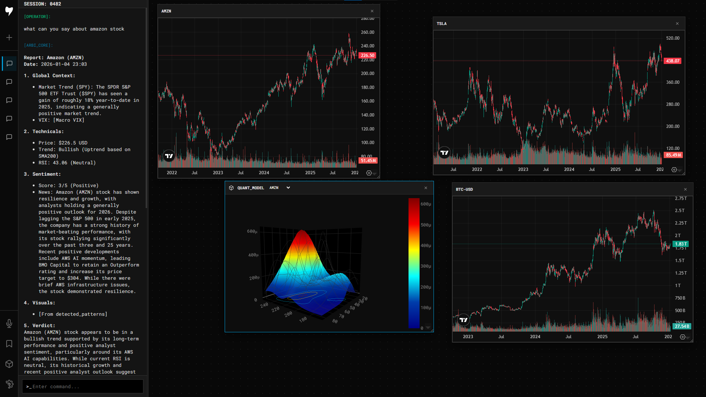

### **Arbitron Systems (Terminal) / ARBI OS**



### Welcome to my AS Terminal!
| Category | Component / Stack | Technical Description |
| :--- | :--- | :--- |
| **Architecture** | FastAPI | Asynchronous backend for handling concurrent LLM and data requests. |
| **Frontend** | Vue.js 3 | Composition API based SPA with a custom draggable/resizable window manager. |
| **Database** | SQLite | Persistent storage for chat sessions, ticker watchlists etc. |
| **LLM** | Google Gemini Flash | AI for compiling a response based on the context received. |
| **Quant Engine** | Scipy / NumPy / Pandas | Backend calculation of Gaussian models and probability density functions. |
| **Data Ingestion** | yFinance API | Extraction of financial data and historical market statistics. |
| **News Retrieval** | DuckDuckGo Search DDGS| Real-time web scraping and indexing for current market news and events. |
| **Visualization 1** | Plotly.js | 3D Mesh rendering of volatility surfaces and quantitative distributions. |
| **Visualization 2** | TradingView Widget | Third-party iframe integration for technical analysis. |
| **Communication** | WebSockets | Full-duplex communication for live-chat and real-time data streaming. |
| **Infrastructure** | Pydantic / Settings | Data validation and environment-based configuration management. |

I’ve always loved the concept of an all-in-one terminal that handles everything from raw data to advanced modeling like Gaussian distributions. What started as a basic AI wrapper has evolved into a full-scale "Bloomberg Terminal" clone with a built-in personal assistant.
The backend currently handles calculations for sentiment analysis, trends, and price data. I'm currently using TradingView widgets, but I’m looking to develop my own data-driven visualization system soon. The next big step is integrating Qlib to make the terminal’s output even more accurate and professional.
I’m 16, I’m constantly learning, and yes, I use AI to help optimize my workflow and architecture. Now, I’m looking for a team to help me scale this project to a level where we can seek serious investment.

---
### **Quick Start:**

1. Create and Activate Virtual Environment

On Windows:
```bash
python -m venv venv
venv\Scripts\activate
```
On Linux / macOS:
```bash
python3 -m venv venv
source venv/bin/activate
```
2. Install Requirements
Once the environment is activated, install all necessary libraries:
```bash
pip install --upgrade pip
pip install -r requirements.txt
```
3. Configure Environment Variables
Create a `.env` file in the root directory and add your API keys. **Do not share this file!** 
```env
GEMINI_API_KEY=your_google_gemini_key
```
4. Launch the Terminal
Run the main entry point of the application:
```bash
python launch.py
```
---

**Found a bug? Architecture is a mess?**

Don't be shy — **[open an issue](https://github.com/arbitrum1984/Arbitron_Systems/issues/new)** and tell me why my code sucks. I'm 16 and I want to learn from the best.

--- 

**For network:**

Email -> arbitronsystems [at] outlook.com

BMC -> [buymeacoffee.com/arbitrum1984](https://buymeacoffee.com/arbitrum1984)

Thank You!


