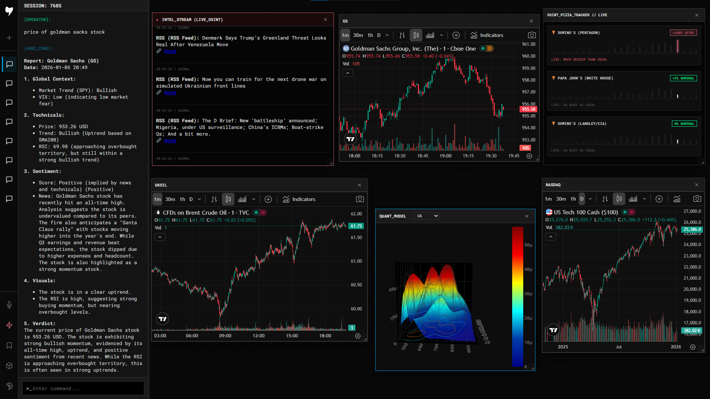

### **Arbitron Systems (Terminal) / ARBI OS**



### Welcome to my AS Terminal!
| Category | Component / Stack | Technical Description |
| :--- | :--- | :--- |
| **Architecture** | FastAPI | Asynchronous backend for handling concurrent LLM and data requests. |
| **Frontend** | Vue.js 3 | Composition API based SPA with a custom draggable/resizable window manager. |
| **Database** | SQLite | Persistent storage for chat sessions, ticker watchlists etc. |
| **LLM** | Google Gemini Flash | AI for compiling a response based on the context received. |
| **RAG Pipeline** | Custom Logic | 3-Stage inference: Intent Extraction → Data Enrichment → Response Generation. |
| **Quant Engine** | Scipy / NumPy / Pandas | Backend calculation of Gaussian models and probability density functions. |
| **OSINT / Intel** | Apify / RSS | Automated scraping of Twitter & Feeds for geopolitical signals. |
| **Alternative Data** | "The Pizza Meter" | Tracking pizza occupancy near Pentagon/CIA as a crisis proxy. |
| **Visualization** | Plotly.js / TradingView | 3D Volatility surfaces and iframe integration for technical analysis. |
| **Infrastructure** | Pydantic / Settings | Data validation and environment-based configuration management. |

The next big step is integrating Qlib to make the terminal’s output even more accurate and professional. I’m 16, I’m constantly learning, and yes, I use AI to help optimize my workflow and architecture. Now, I’m looking for a team to help me scale this project.

---

### **Core Modules**

**1. The Intelligence Engine (OSINT)**
The system runs background `asyncio` tasks to poll alternative data sources:
*   **Twitter & RSS Monitor:** Filters feeds for high-impact keywords (e.g., *Tanker, Sanctions*) while discarding noise.
*   **The Pizza Meter:** Implements the famous OSINT theory that high pizza orders at government agencies (Pentagon, White House) predict major political events. (Includes both simulation and live API modes).

**2. Quant & Technical Analysis**
*   **3D Volatility Surface:** Backend generation of Kernel Density Estimates (KDE) rendered as interactive 3D meshes.
*   **Automated Technicals:** The AI agent automatically calculates RSI and Trends (SMA200) when a ticker is detected in the chat.

**3. RAG Architecture**
The chatbot uses a multi-step pipeline:
*   *Step 1:* Extract Intent & Ticker (JSON).
*   *Step 2:* Fetch Live Price, Indicators, and DuckDuckGo News.
*   *Step 3:* Synthesize a professional financial report.

---
### **Quick Start:**

1. Clone the Repository
```bash
git clone https://github.com/arbitrum1984/Arbitron_Systems.git
cd Arbitron_Systems
```

2. Create and Activate Virtual Environment
```bash
python -m venv venv
# Windows:
venv\Scripts\activate
# Linux/Mac:
source venv/bin/activate
```

3. Install Requirements
```bash
pip install --upgrade pip
pip install -r requirements.txt
```

4. Configure Environment Variables
Create a `.env` file in the root directory.
```env
GEMINI_API_KEY="your_google_gemini_key"
# Optional (for full OSINT features):
APIFY_API_KEY="your_apify_key"
SERPAPI_API_KEY="your_serpapi_key"
RSS_FEEDS="https://www.google.com/alerts/feeds/your_feed_1,..."
```

5. Launch the Terminal
```bash
python main.py
```

ENJOY

