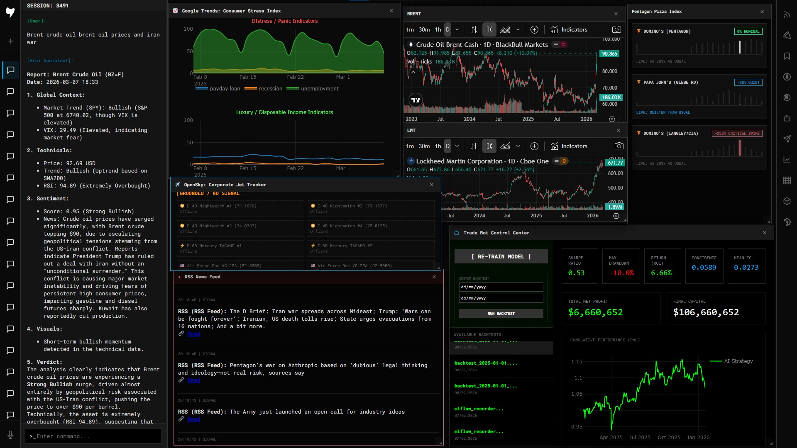

<div align="center">

# 🌌 Arbitron Terminal
**Professional Financial AI Backend with OSINT Integration**

[](https://www.python.org/downloads/release/python-3100/)
[](https://fastapi.tiangolo.com)
[](https://www.docker.com/)
[](https://ai.google.dev/)
[](https://opensource.org/licenses/MIT)

*An advanced, multi-service architecture designed for quantitative trading research, macroeconomic analysis, and real-time open-source intelligence (OSINT) gathering.*

</div>

---



## 📖 Overview

**Arbitron Terminal** is not just an application; it's a comprehensive ecosystem for algorithmic and discretionary traders. It bridges the gap between hard quantitative data (prices, macroeconomics, SEC filings) and soft alternative data (social sentiment, geopolitical alerts, satellite-grade OSINT, and corporate jet tracking).

The platform is divided into a sleek **Terminal Dashboard** (Frontend + API Gateway) and a heavy-duty **Quant Engine** (Machine Learning & Backtesting), orchestrated seamlessly via Docker Compose.

---

## 🏗️ Architecture & Microservices

The ecosystem consists of 5 core dockerized microservices working in tandem:

| Service | Technology | Port | Description |
| :--- | :--- | :--- | :--- |
| 🛡️ **Terminal (API/UI)** | `FastAPI` + `Vanilla JS/CSS` | `8000` | The main brain of the UI. Serves the dashboard, proxies requests, handles AI chats (Gemini), and runs background OSINT polling loops. |
| 🧠 **Quant Engine** | `FastAPI` + `Qlib` + `MLflow` | `8001` | The ML inference server. Provides an API for real-time market predictions, historical backtest data, and model diagnostics. |
| 🍕 **Pizza Scraper** | `FastAPI` + `Playwright` | `8002` | A dedicated headless-browser microservice that scrapes real-time occupancy data from Google Maps for the Pentagon Pizza Index. |
| 🏭 **Quant Worker** | `Celery` | `-` | An asynchronous, heavy-duty worker designed for background model training, massive data ingestion, and complex backtests. |
| 📨 **Redis** | `Redis:7-alpine` | `6379` | The message broker connecting the FastAPI Quant Engine with the Celery Worker for distributed task queues. |

---

## 🌟 Core Features & Capabilities

### 1. 🤖 AI & Natural Language Interface
- **GenAI Integration**: Powered by **Google Gemini Flash Lite**. Allows users to chat directly with their data, ask for market summaries, or request analysis on any asset class.
- **Multi-Asset Ticker Recognition**: Automatically detects and resolves stocks, commodities (`Brent Oil → BZ=F`), crypto (`Bitcoin → BTC-USD`), forex (`EUR/USD`), and indices (`S&P 500 → SPY`) from natural language queries.
- **Context-Aware**: The AI agent is enriched with live OSINT feeds, flight tracking data, consumer stress indicators, and macroeconomic context before generating responses.

### 2. 📊 Quantitative Trading Engine (`Qlib`)
- **Real-Time Inference**: Ask the engine for live predictions (signals) on specific tickers based on the latest trained ML models.
- **Full-Scale Backtesting**: Run historical backtests, evaluate portfolio performance, and view interactive `Plotly` equity curves directly in the UI.
- **Automated ML Pipelines**: Trigger full model retraining pipelines in the background via Celery, tracking experiments natively.

### 3. 🌐 Open-Source Intelligence (OSINT)
- **🐦 Twitter Sentiment**: Monitors crypto and market sentiment on X (Twitter) via Apify.
- **📰 RSS & Alert Aggregator**: Ingests automated Google Alerts and selected RSS feeds (Defense, Oil, Geopolitics) for breaking news.
- **🍕 The "Pentagon Pizza" Index**: A custom OSINT tracker that monitors the busyness (occupancy) of local pizza places near major US government institutions (e.g., The Pentagon, Langley) to predict late-night crisis meetings.

### 4. ✈️ Corporate & Military Flight Tracker (OpenSky Network)
- **25 Tracked Aircraft** including:
  - 💼 **Billionaire Jets**: Elon Musk, Jeff Bezos, Bill Gates, Mark Zuckerberg, Larry Ellison, Taylor Swift, Ken Griffin, Jamie Dimon, and more.
  - 🇺🇸 **Presidential Aircraft**: Both Air Force One VC-25A airframes + C-32A Vice Presidential aircraft.
  - ☢️ **Doomsday Planes**: All 4 E-4B Nightwatch (NAOC) aircraft — if these go airborne, it's a major geopolitical signal.
  - ⚡ **E-6B Mercury TACAMO**: Nuclear command-and-control relay aircraft (Looking Glass).
- **AI Context Injection**: Flight status is automatically fed into the AI's context, allowing queries like *"Where is Elon Musk's jet right now?"*

### 5. 📈 Fundamental & Macro Data
- **🏛️ SEC EDGAR**: Automatically pulls and caches official financial facts (10-K, 10-Q) directly from the U.S. Securities and Exchange Commission.
- **📉 FRED Macroeconomics**: Native integration with the Federal Reserve Economic Data (FRED) API for interest rates, inflation schemas, and housing data.
- **📊 Google Trends**: Real-time consumer stress indicators — tracks "payday loan", "recession", "unemployment" vs. luxury spending keywords to gauge economic sentiment.

### 6. 🖥️ Dual-Sidebar Terminal UI
- **Left Sidebar**: Session management — create, switch, and delete AI chat sessions.
- **Right Sidebar**: Quick-launch toolbar for all floating windows (RSS, Pizza Index, EDGAR, FRED, Trade Bot, Flight Tracker, Trends, Docker Logs, 3D Visualization, Settings).
- **Dark-Themed Scrollbars**: Ultra-minimal, transparent scrollbars across the entire interface.
- **Draggable Windows**: All data panels are freely draggable and resizable across the desktop area.

---

## 🚀 Getting Started

### Prerequisites

Ensure you have the following installed on your host machine:
- [Docker Engine](https://docs.docker.com/get-docker/)
- [Docker Compose](https://docs.docker.com/compose/install/) (v2.0+)
- A [Google Gemini API Key](https://aistudio.google.com/app/apikey)
- A [FRED API Key](https://fred.account.stlouisfed.org/apikeys) (Optional)

### Installation Guide

1. **Clone the Repository**
   ```bash
   git clone https://github.com/YOUR_USERNAME/Arbitron_Systems.git
   cd Arbitron_Systems
   ```

2. **Configure Environment Variables**
   We have provided a secure template. Copy it and fill in your keys:
   ```bash
   cp .env.example .env
   ```
   *Open `.env` in your text editor and populate at least the `GEMINI_API_KEY`.*

3. **Build & Spin Up the Ecosystem**
   Let Docker handle the complexities of dependencies, networking, and volumes.
   ```bash
   docker-compose up -d --build
   ```

4. **Access the Application**
   - 💻 **Arbitron Terminal UI**: Open `http://localhost:8000` in your browser.
   - 🔌 **Terminal Swagger API Docs**: `http://localhost:8000/docs`
   - 🧠 **Quant Engine API Docs**: `http://localhost:8001/docs`

### Shutting Down

To gracefully stop the platform and remove the containers (your database and ML models will be safely preserved in Docker volumes):
```bash
docker-compose down
```

---

## 📂 Directory Structure

```text
Arbitron_Systems/
├── .env.example               # Template for API keys
├── docker-compose.yml         # Container orchestration
├── terminal/                  # Backend API & Frontend SPA
│   ├── app/                   # FastAPI application logic
│   │   ├── api/               # Router endpoints (Chat, Logs)
│   │   ├── services/          # Business logic (OSINT, EDGAR, AI, OpenSky, Trends)
│   │   └── core/              # Configs & Prompts
│   └── static/                # HTML/JS/CSS Dashboard
├── pizza_scraper/             # Headless browser scraping microservice
│   ├── main.py                # FastAPI + Playwright scraper
│   └── Dockerfile             # Chromium-based container
└── quant_engine/              # ML Engine & Data Processing
    ├── inference_api.py       # API for Predictions & Backtesting
    ├── tasks.py               # Celery asynchronous worker tasks
    ├── configs/               # ML Pipeline configurations
    └── scripts/               # Deep Qlib integrations
```

---

## 🛰️ Data Sources

| Source | Type | Update Frequency | Cost |
| :--- | :--- | :--- | :--- |
| **OpenSky Network** | ADS-B Flight Tracking | Every 5 min | Free |
| **Yahoo Finance** | Stocks, Commodities, Crypto, Forex | Real-time | Free |
| **SEC EDGAR** | Corporate Filings (10-K, 10-Q) | On-demand | Free |
| **FRED** | Macroeconomic Indicators | On-demand | Free |
| **Google Trends** | Consumer Sentiment | Every 15 min | Free |
| **DuckDuckGo News** | News Search | Per-query | Free |
| **Google Maps** | Pentagon Pizza Occupancy | Every 5 min | Free |
| **RSS Feeds** | Geopolitical & Defense News | Every 5 min | Free |

---

## 🔒 Security Notice

This repository contains an `.env.example` file. 
**NEVER commit your production `.env` file containing real API keys or secrets to version control.** 
The `.gitignore` is pre-configured to prevent accidental leaks of your `.venv`, `.env`, and generated SQLite databases.

---

<div align="center">
  <sub>Built for the future of decentralized and quantitative finance.</sub>
</div>
